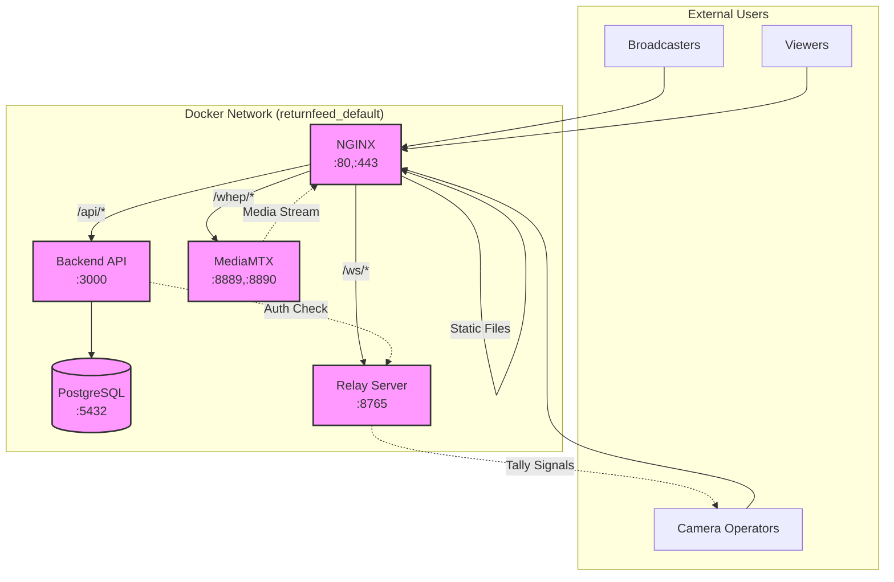
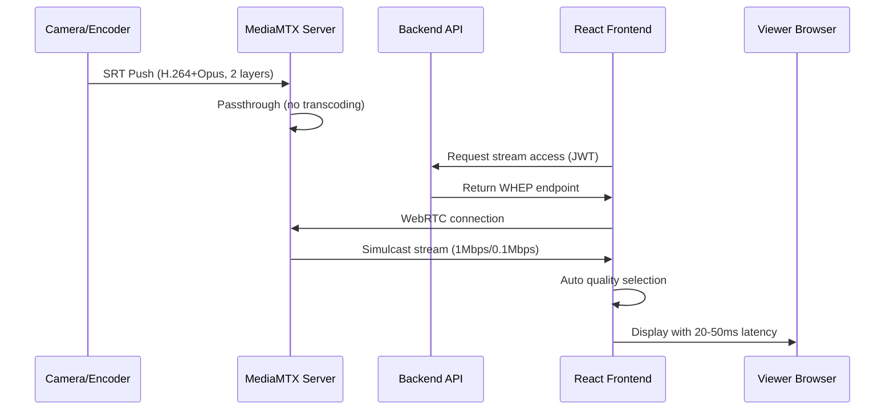
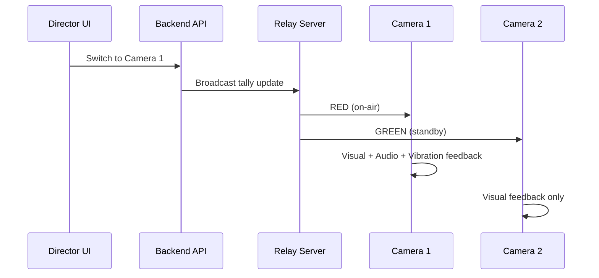
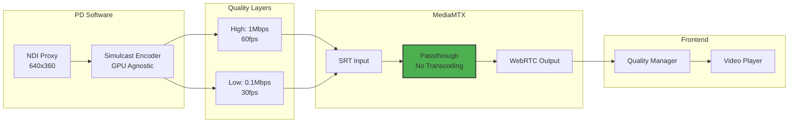

# ReturnFeed 시스템 아키텍처 설계 문서

## 1. 개요

본 문서는 ReturnFeed 클라우드 네이티브 라이브 프로덕션 플랫폼의 시스템 아키텍처를 상세히 설명합니다. Docker 기반의 마이크로서비스 아키텍처를 채택하여 확장성, 보안성, 그리고 유지보수성을 극대화했습니다.

### 1.1 아키텍처 원칙

- **컨테이너화**: 모든 서비스는 Docker 컨테이너로 격리
- **마이크로서비스**: 각 기능을 독립적인 서비스로 분리
- **보안 우선**: 제로 트러스트 원칙 적용
- **확장성**: 수평적 확장이 가능한 구조
- **관찰 가능성**: 로깅, 모니터링, 추적 기능 내장
- **초저지연**: 패스스루 모드로 20-50ms 달성
- **적응형 스트리밍**: 2-레이어 시뮬캐스트 지원

---

## 2. 시스템 구성 요소

### 2.1 컨테이너 서비스

| 서비스 | 이미지 | 포트 | 역할 |
| :--- | :--- | :--- | :--- |
| **nginx** | nginx:alpine | 80, 443 | 리버스 프록시, SSL 종료, 정적 파일 서빙 |
| **backend** | node:20-alpine | 3000 | Express API 서버, 비즈니스 로직 |
| **postgres** | postgres:15 | 5432 | 주 데이터베이스, 사용자/세션 관리 |
| **mediamtx** | bluenviron/mediamtx:latest-ffmpeg | 8889, 8890/udp, 8189/udp | 미디어 게이트웨이 (패스스루 모드) |
| **relay** | python:3.9-slim | 8765 | WebSocket 릴레이 서버, 탤리 신호 분배 |

### 2.2 기술 스택

| 계층 | 기술 | 버전 |
| :--- | :--- | :--- |
| **Frontend** | React + TypeScript | 19.1.0 |
| **Backend** | Express + TypeScript | 5.1.0 |
| **Database** | PostgreSQL | 15 |
| **Media Server** | MediaMTX | latest-ffmpeg |
| **Container** | Docker + Docker Compose | 24.0+ |

---

## 3. 아키텍처 다이어그램

### 3.1 시스템 아키텍처 (현재 구조)

ReturnFeed는 Docker Compose로 오케스트레이션되는 마이크로서비스 아키텍처를 사용합니다.



### 3.2 데이터 플로우

#### 3.2.1 비디오 스트리밍 플로우



#### 3.2.2 탤리 시그널 플로우



---

## 4. 보안 아키텍처

### 4.1 인증 및 권한 부여

| 계층 | 기술 | 설명 |
| :--- | :--- | :--- |
| **사용자 인증** | JWT + Google OAuth 2.0 | 로컬 및 소셜 로그인 지원 |
| **API 보안** | JWT Bearer Tokens | 모든 API 엔드포인트 보호 |
| **WebSocket 보안** | JWT 기반 인증 | 연결 시 JWT 토큰 검증 |
| **데이터 암호화** | bcrypt (cost factor: 10) | 비밀번호 해싱 |
| **환경 변수** | .env 파일 | 모든 민감한 정보 보호 |

### 4.2 네트워크 보안

| 구분 | 설정 | 설명 |
| :--- | :--- | :--- |
| **SSL/TLS** | Let's Encrypt / 자체 서명 | 모든 HTTP 통신 암호화 |
| **CORS** | 명시적 화이트리스트 | 허가된 도메인만 접근 |
| **포트 보안** | Docker 네트워크 격리 | 필요한 포트만 노출 |

---

## 5. 데이터베이스 스키마

### 5.1 주요 테이블

```sql
-- 사용자 테이블
CREATE TABLE users (
    id SERIAL PRIMARY KEY,
    email VARCHAR(255) UNIQUE NOT NULL,
    password VARCHAR(255),
    google_id VARCHAR(255) UNIQUE,
    name VARCHAR(255),
    created_at TIMESTAMP DEFAULT NOW(),
    updated_at TIMESTAMP DEFAULT NOW()
);

-- 세션 테이블
CREATE TABLE sessions (
    id UUID PRIMARY KEY DEFAULT gen_random_uuid(),
    name VARCHAR(255) NOT NULL,
    created_by INTEGER REFERENCES users(id),
    is_active BOOLEAN DEFAULT true,
    created_at TIMESTAMP DEFAULT NOW(),
    updated_at TIMESTAMP DEFAULT NOW()
);

-- 참가자 테이블 (세션별 사용자)
CREATE TABLE session_participants (
    id SERIAL PRIMARY KEY,
    session_id UUID REFERENCES sessions(id),
    user_id INTEGER REFERENCES users(id),
    role VARCHAR(50) CHECK (role IN ('director', 'camera', 'viewer')),
    joined_at TIMESTAMP DEFAULT NOW(),
    UNIQUE(session_id, user_id)
);
```

---

## 6. 배포 및 운영

### 6.1 Docker Compose 설정

```yaml
services:
  nginx:
    image: nginx:alpine
    volumes:
      - ./nginx/nginx.conf:/etc/nginx/nginx.conf:ro
      - ./nginx/certs:/etc/nginx/certs:ro
      - ./frontend/dist:/usr/share/nginx/html:ro
    ports:
      - "80:80"
      - "443:443"
    depends_on:
      - backend
      - relay
      - mediamtx

  backend:
    build: ./backend
    environment:
      - NODE_ENV=production
      - DATABASE_URL=${DATABASE_URL}
      - JWT_SECRET=${JWT_SECRET}
      - GOOGLE_CLIENT_ID=${GOOGLE_CLIENT_ID}
      - GOOGLE_CLIENT_SECRET=${GOOGLE_CLIENT_SECRET}
    depends_on:
      - postgres

  postgres:
    image: postgres:15
    environment:
      - POSTGRES_DB=returnfeed
      - POSTGRES_USER=${DB_USER}
      - POSTGRES_PASSWORD=${DB_PASSWORD}
    volumes:
      - postgres_data:/var/lib/postgresql/data

  mediamtx:
    image: bluenviron/mediamtx:latest-ffmpeg
    ports:
      - "8890:8890/udp"  # SRT
      - "8899:8889"      # WebRTC (mapped)
      - "8189:8189/udp"  # WebRTC ICE
    environment:
      - SRT_PASSPHRASE=${SRT_PASSPHRASE}
    volumes:
      - ./mediamtx/mediamtx-minimal.yml:/mediamtx.yml:ro

  relay:
    build: ./relay
    environment:
      - JWT_SECRET=${JWT_SECRET}
```

### 6.2 확장성 고려사항

1. **수평적 확장**: Docker Swarm 또는 Kubernetes로 전환
2. **로드 밸런싱**: NGINX Plus 또는 HAProxy 사용
3. **캐싱**: Redis 추가로 성능 향상
4. **CDN**: 정적 자산 및 HLS 스트림을 위한 CloudFront

---

## 7. 시뮬캐스트 아키텍처

### 7.1 2-레이어 시뮬캐스트 구조



### 7.2 품질 전환 알고리즘

| 메트릭 | High → Low | Low → High |
|--------|------------|------------|
| **패킷 손실** | > 3% | < 1% |
| **RTT** | > 150ms | < 100ms |
| **대역폭** | < 200kbps | > 1.5Mbps |
| **전환 쿨다운** | 5초 | 5초 |

### 7.3 성능 지표

- **인코딩 지연**: 10-15ms
- **전송 지연**: 5-10ms  
- **MediaMTX 지연**: 0-5ms (패스스루)
- **WebRTC 지연**: 10-20ms
- **총 지연**: 20-50ms (평균 40ms)

---

## 8. 보안 강화 (v4.1)

### 8.1 제로 트랜스코딩 보안

- **암호화**: SRT 전송 시 AES-256 암호화
- **인증**: SRT 스트림 ID 기반 인증
- **격리**: 세션별 스트림 격리

### 8.2 시뮬캐스트 보안

- **품질별 권한**: 역할에 따른 품질 접근 제어
- **자동 다운그레이드**: 권한 없는 사용자는 저품질만 허용
- **메트릭 보호**: 네트워크 통계 접근 제한

---

## 9. 모니터링 및 로깅

### 9.1 시뮬캐스트 모니터링

```yaml
metrics:
  - name: simulcast_quality_switches
    type: counter
    labels: [session_id, from_quality, to_quality]
  
  - name: simulcast_active_viewers
    type: gauge
    labels: [session_id, quality]
  
  - name: network_packet_loss
    type: histogram
    labels: [session_id, user_id]
```

### 9.2 계획된 모니터링 스택

- **로깅**: Winston (Node.js), Docker 로그 드라이버
- **메트릭**: Prometheus + Grafana
- **에러 추적**: Sentry
- **APM**: New Relic 또는 DataDog
- **품질 분석**: 커스텀 시뮬캐스트 대시보드

---

_마지막 업데이트: 2025년 1월 17일_