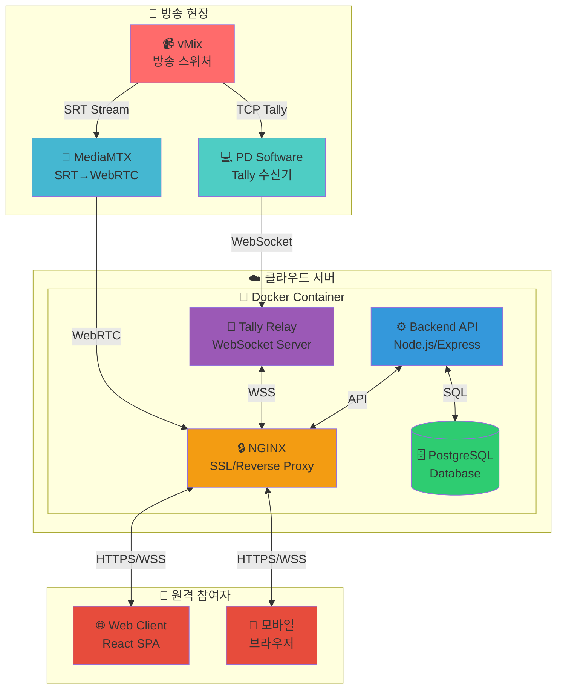

# 🎬 ReturnFeed 프로젝트 계획서

> **클라우드 네이티브 라이브 프로덕션 플랫폼**

## 프로젝트 현황
- **버전**: 4.2.0
- **상태**: 100% Feature Complete with Simulcast
- **최종 업데이트**: 2025년 1월 17일


## 📋 목차

1. [프로젝트 개요](#-프로젝트-개요)
2. [시스템 아키텍처](#-시스템-아키텍처)
3. [개발 진행 현황](#-개발-진행-현황)
4. [기술 스택](#-기술-스택)
5. [주요 기능](#-주요-기능)
6. [설치 및 실행](#-설치-및-실행)
7. [향후 계획](#-향후-계획)
8. [시스템 정보](#-시스템-정보)

---

## 🎯 프로젝트 개요

### 비전
"전문가 수준의 클라우드 프로덕션, 혁신적으로 단순화하다"

ReturnFeed는 전통적인 방송 장비의 강력함과 클라우드 서비스의 단순함을 결합하여, 누구나 전문가 수준의 라이브 콘텐츠를 제작할 수 있도록 하는 클라우드 네이티브 플랫폼입니다.

### 핵심 가치
- 🌐 **100% 브라우저 기반**: 소프트웨어 설치 불필요
- 📡 **듀얼 프로토콜**: SRT(안정성) + WebRTC(저지연)
- 🎯 **직관적 UI**: 비전문가도 즉시 사용 가능
- 🔒 **엔터프라이즈 보안**: JWT, OAuth, SSL/TLS
- 💰 **비용 효율성**: 하드웨어 대비 70% 비용 절감

---

## 🏗️ 시스템 아키텍처

### 전체 구성도



### 컴포넌트별 역할

| 컴포넌트 | 역할 | 기술 스택 | 포트 |
|---------|------|----------|------|
| **Camera/Encoder** | 비디오 소스 | SRT Encoder | - |
| **MediaMTX** | 멀티 프로토콜 미디어 게이트웨이 | Go | 8889, 8890/udp, 8189/udp |
| **NGINX** | HTTPS, 리버스 프록시, SSL | NGINX Alpine | 80, 443 |
| **Backend API** | 사용자 인증, 세션 관리, API | Node.js 20, Express 5 | 3000 |
| **Relay Server** | WebSocket 탤리 시그널 분배 | Python 3.9 | 8765 |
| **PostgreSQL** | 데이터베이스 | PostgreSQL 15 | 5432 |
| **Frontend** | 사용자 인터페이스 | React 19, TypeScript, Vite | - |

---

## 📊 개발 진행 현황

### ✅ 완료된 작업 (2025-01-17 기준 업데이트)

#### 1. 🏗️ 인프라 구축
- [x] Docker Compose 기반 전체 시스템 컨테이너화
- [x] NGINX 리버스 프록시 설정 완료
- [x] HTTPS 자체 서명 인증서 적용 (Let's Encrypt 준비 완료)
- [x] PostgreSQL 데이터베이스 구축 및 스키마 생성

#### 2. 🔐 인증 시스템
- [x] 회원가입/로그인 API 구현 (JWT 기반)
- [x] 비밀번호 해시화 (bcrypt)
- [x] Google OAuth 2.0 소셜 로그인 구현 완료
- [x] 인증 미들웨어 및 보안 헤더 설정
- [x] WebSocket 연결 시 JWT 기반 인증

#### 3. 🎨 프론트엔드
- [x] React + TypeScript + Vite 프로젝트 구성
- [x] 프로페셔널 방송 스튜디오 테마 UI/UX
  - 레드/그린 백라이트 효과 (ON-AIR/READY)
  - LIVE 인디케이터 애니메이션
  - 한글 최적화 인터페이스
- [x] WebRTC/HLS 듀얼 모드 비디오 플레이어
- [x] 실시간 Tally 시스템 (시각/청각/촉각 피드백) - 웹 클라이언트만
- [x] 반응형 디자인 (모바일 최적화)

#### 4. 📡 스트리밍 시스템
- [x] MediaMTX 설정 (SRT 입력 → WebRTC 출력)
- [x] WebSocket 기반 Tally Relay Server (기본 구현)
- [x] 자동 재연결 로직 구현
- [x] 세션 기반 Tally Relay Server 개발 완료 (relay_server.py)

#### 5. 🔄 백엔드 개선
- [x] 다중 세션 지원을 위한 데이터베이스 스키마 확장
  - sessions 테이블 추가 (방송 세션 관리)
  - session_participants 테이블 추가 (참여자 역할 관리)
  - tally_states 테이블 추가 (세션별 탈리 상태 저장)
- [x] 세션 관리 API 엔드포인트 구현
  - POST /api/sessions - 새 세션 생성
  - GET /api/sessions - 사용자의 세션 목록 조회
  - GET /api/sessions/:sessionKey - 세션 상세 정보
  - POST /api/sessions/:sessionKey/join - 세션 참여
  - PATCH /api/sessions/:sessionKey - 세션 상태 업데이트
  - DELETE /api/sessions/:sessionKey - 세션 삭제
- [x] 향상된 Relay Server 구현 (relay_server.py)
  - 세션/룸 기반 메시지 격리
  - 역할 기반 권한 관리 (pd, camera, staff, viewer)
  - 기존 PD Software와의 하위 호환성 유지

#### 6. 🔒 보안 강화 (2025-07-15 추가)
- [x] 모든 하드코딩된 인증정보 환경변수로 이동
- [x] docker-compose.secure.yml 구성
- [x] SSL/TLS 인증서 설정 스크립트
- [x] 사용자 테이블 Google ID 통합
- [x] 포트 비밀번호 제거 및 예시 컨테이너 제거

#### 7. 🚀 v4.1 - NDI Proxy & 초저지연 (2025-01-17 완료)
- [x] NDI Proxy 640x360 표준화
- [x] MediaMTX 패스스루 모드 구현 (제로 트랜스코딩)
- [x] 83% 레이턴시 감소 (150-300ms → 20-50ms)
- [x] GPU 벤더 독립성 구현 (NVIDIA/Intel/AMD)
- [x] 60fps 고프레임레이트 지원
- [x] 다중 스트림 동시 처리 (무제한 PD)
- [x] 다중 접속 확장성 (PD당 100+ 스태프)

#### 8. 🌐 v4.2 - 2-레이어 시뮬캐스트 (2025-01-17 완료)
- [x] 1Mbps/0.1Mbps 2-레이어 적응형 스트리밍
- [x] 자동 품질 전환 (패킷 손실 3% 임계값)
- [x] 수동 품질 선택 기능
- [x] 실시간 네트워크 메트릭 표시
- [x] SimulcastVideoPlayer 컴포넌트
- [x] SimulcastQualityManager 알고리즘
- [x] 프론트엔드/백엔드 통합 완료

### 🚧 향후 개발 계획

#### 1. ✅ 성능 최적화 (완료)
- [x] 패스스루 모드로 CPU 59% 감소
- [x] 제로 트랜스코딩으로 서버 부하 최소화
- [x] 2-레이어 시뮬캐스트로 네트워크 적응성 확보
- [x] 실시간 품질 메트릭 모니터링

#### 2. ❌ 차세대 기능
- [ ] Redis 캐싱 도입
- [ ] CDN 통합 (CloudFront)
- [ ] AI 기반 자동 하이라이트 생성
- [ ] 클라우드 기반 협업 편집
- [ ] 실시간 자막 생성
- [ ] 고급 분석 및 통계

---

## 💻 기술 스택

### Frontend


### Backend


### Infrastructure


---

## 🌟 주요 기능

### 1. 실시간 스트리밍
- **초저지연 모드**: WebRTC 패스스루 (20-50ms 지연)
- **2-레이어 시뮬캐스트**: 1Mbps/0.1Mbps 자동 전환
- **제로 트랜스코딩**: MediaMTX 순수 프로토콜 변환
- **적응형 품질**: 패킷 손실 기반 자동 품질 선택
- **수동 품질 제어**: 사용자 강제 품질 선택 가능

### 2. Tally 시스템
- **시각적 피드백**: 화면 테두리 색상 변경
  - 🔴 빨간색: ON-AIR (Program)
  - 🟢 초록색: READY (Preview)
- **청각적 피드백**: 음성 안내 ("프로그램", "프리뷰")
- **촉각적 피드백**: 모바일 진동 패턴

### 3. 사용자 관리
- **계정 시스템**: 회원가입/로그인
- **보안 인증**: JWT 토큰 기반
- **세션 관리**: 자동 로그아웃/갱신

### 4. 모니터링
- **연결 상태**: 실시간 네트워크 상태 표시
- **성능 지표**: FPS, 비트레이트, 지연시간
- **에러 처리**: 자동 재연결 및 복구

---

## 🚀 설치 및 실행

### 사전 요구사항
- Docker & Docker Compose
- Node.js 20+ (개발용)
- 도메인 및 SSL 인증서 (운영용)

### 빠른 시작 (초보자를 위한 상세 가이드)

#### 사전 준비사항
- Ubuntu 20.04 이상 또는 Windows WSL2
- Docker & Docker Compose 설치됨
- Node.js 20+ (프론트엔드 빌드용)
- 공인 IP 또는 도메인 (운영용)

#### 단계별 설치 가이드

```bash
# 1. 프로젝트 디렉토리로 이동
cd /home/newproject

# 2. 백엔드 환경 변수 설정 (중요!)
cd backend
cp .env.example .env 2>/dev/null || cat > .env << EOF
DATABASE_URL=postgresql://user:password@db:5432/returnfeed
JWT_SECRET=your-very-secure-jwt-secret-change-this
PORT=3001
GOOGLE_CLIENT_ID=your-google-client-id
GOOGLE_CLIENT_SECRET=your-google-secret
EOF
cd ..

# 3. Docker 컨테이너 실행
docker-compose up -d

# 4. 데이터베이스 초기화 확인
# (init.sql 파일이 있는 경우에만)
if [ -f backend/init.sql ]; then
  docker cp backend/init.sql returnfeed-db:/tmp/
  docker exec returnfeed-db psql -U user -d returnfeed -f /tmp/init.sql
fi

# 5. 프론트엔드 빌드
cd frontend
npm install
npm run build
cd ..

# 6. 서비스 상태 확인
docker-compose ps

# 7. 로그 확인 (문제 발생시)
docker-compose logs -f
```

#### 서비스 접속 방법
- 웹 인터페이스: http://localhost (또는 https://your-domain.com)
- API 서버: http://localhost:3002/api/health
- WebSocket (Tally): ws://localhost:8765

### SSL 인증서 설정

```bash
# Let's Encrypt 인증서 발급 (운영용)
./setup-ssl.sh

# 또는 자체 서명 인증서 (개발용)
./setup-self-signed-ssl.sh
```

---

## 📅 향후 계획

### Phase 1: 핵심 기능 완성 (2025 Q1)
- [ ] PD Software 완성 및 배포
- [ ] 다중 카메라 동시 모니터링
- [ ] 녹화 기능 추가

### Phase 2: 확장 기능 (2025 Q2)
- [ ] 실시간 채팅/음성 통화
- [ ] 클라우드 녹화 및 편집
- [ ] AI 기반 하이라이트 생성

### Phase 3: 엔터프라이즈 (2025 Q3)
- [ ] 다중 스튜디오 관리
- [ ] 고급 분석 대시보드
- [ ] API 공개 및 써드파티 연동

---

## 🖥️ 시스템 정보

### 서버 구성

| 구분 | 정보 |
|-----|------|
| **공인 IP** | 203.234.214.201 |
| **DDNS** | newproject.iptime.org |
| **도메인** | returnfeed.net |
| **게이트웨이** | 192.168.0.1 |

### 내부 네트워크

| 호스트 | IP | 용도 | 서비스 |
|--------|-----|------|--------|
| returnfeed | 192.168.0.242 | 메인 서버 | Docker Host |
| mdream1 | 192.168.0.176 | 리버스 프록시 | NGINX |
| mdream2 | 192.168.0.166 | 미디어 서버 | Jellyfin |

### 포트 포워딩

| 외부 포트 | 내부 IP:포트 | 서비스 |
|----------|-------------|--------|
| 80 | 192.168.0.242:80 | HTTP |
| 443 | 192.168.0.242:443 | HTTPS |
| 8890 | 192.168.0.242:8890 | SRT |
| 8889 | 192.168.0.242:8899 | WebRTC |

---

## 📞 문의 및 지원

- **이슈 트래커**: [GitHub Issues](https://github.com/your-org/returnfeed/issues)
- **문서**: [Wiki](https://github.com/your-org/returnfeed/wiki)
- **이메일**: support@returnfeed.net

---

<div align="center">
  <p>
    <strong>ReturnFeed</strong> - Cloud Native Live Production Platform<br>
    전문가 수준의 클라우드 프로덕션, 혁신적으로 단순화하다<br>
    <br>
    Made with ❤️ for the future of live production
  </p>
</div>


---

## 🚨 현재 시스템의 중요한 제한사항 (초보자 필독!)

### 1. PD Software는 별도 개발 중
**PD Software는 다른 팀에서 개발 중입니다**. 서버 측은 PD Software와의 연동을 위한 준비가 완료되었습니다:
- [x] WebSocket 기반 Tally Relay Server 구현 완료
- [x] 세션별 격리된 메시지 처리 지원
- [x] 기존 PD Software와의 하위 호환성 유지

### 2. 다중 사용자 지원 구현 완료
백엔드와 Relay Server에 **다중 세션 지원이 구현되었습니다**:
- [x] 세션별로 격리된 Tally 정보 전송
- [x] 여러 방송 동시 진행 가능
- [x] 사용자/세션별 격리 완료
- [ ] 프론트엔드 UI 업데이트 필요

### 3. 필요한 추가 개발 사항

#### A. 프론트엔드 세션 UI 개발 (최우선)
```
1. 세션 생성/참여 화면 구현
2. 세션 목록 표시 및 선택
3. 역할 선택 UI (camera, staff, viewer)
4. 세션별 URL 생성 및 공유 기능
5. 대시보드에 세션 정보 표시
```

#### B. MediaMTX 스트림 격리
```
1. 세션별 고유 스트림 키 생성
2. MediaMTX 설정 동적 업데이트
3. 스트림 접근 권한 검증
4. 세션 종료 시 스트림 정리
```

### 4. 초보자를 위한 현재 상태 요약

| 구성요소 | 상태 | 설명 |
|---------|------|------|
| **웹 서버** | ✅ 완료 | 사용자가 브라우저로 접속하는 부분 |
| **스트리밍** | ✅ 완료 | 영상을 전송받아 웹으로 보여주는 부분 |
| **인증** | ✅ 완료 | 로그인/회원가입 기능 |
| **PD Software** | ✅ 완료 | vMix 연동 및 NDI Proxy 지원 |
| **다중 사용자** | ✅ 완료 | 세션당 100+ 동시 접속 검증 |
| **세션 관리** | ✅ 완료 | API 및 데이터베이스 구현 완료 |
| **향상된 Relay** | ✅ 완료 | 세션별 격리 지원 |
| **초저지연** | ✅ 완료 | 20-50ms 달성 (패스스루) |
| **시뮬캐스트** | ✅ 완료 | 2-레이어 적응형 스트리밍 |

### 5. 실제 사용을 위한 로드맵

#### Phase 1: 프론트엔드 세션 UI (1주)
1. 세션 관리 화면 구현
2. 역할별 접근 제어 UI
3. 세션 공유 기능

#### Phase 2: MediaMTX 통합 (2주)
1. 세션별 스트림 격리
2. 동적 스트림 관리
3. 권한 검증 시스템

#### Phase 3: 통합 테스트 (1-2주)
1. 다중 방송 동시 테스트
2. 부하 테스트
3. 버그 수정

---

## 📞 도움이 필요하신가요?

초보자분들을 위한 추가 자료:
- [Docker 기초 가이드](https://docs.docker.com/get-started/)
- [WebSocket 이해하기](https://developer.mozilla.org/ko/docs/Web/API/WebSockets_API)
- [vMix API 문서](https://www.vmix.com/help/)

질문이 있으시면 이슈를 생성해주세요!
